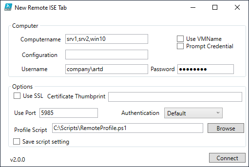

# ISERemoteTab


The module includes a PowerShell function to add new remote tabs in the PowerShell ISE. The default behavior of adding remote tabs in the ISE is very basic and offers no flexibility like specifying an alternate port. This module was created to address those limitations.

This command will create one or more remote tabs in the PowerShell ISE. You could use this to programmatically to open multiple remote tabs.

After importing the module into the ISE be sure to read help and examples. All commands must be run in the PowerShell ISE.

## Basic Usage

The default behavior is to open tabs with your current credentials using [New-ISEREmoteTab](docs/New-ISERemoteTab.md).

```powershell
New-ISERemotetab localhost
```

But you can specify a single credential for all remote connections, or prompt for a credential for each connection. You might need this if some of the machines require different credentials.

```powershell
New-ISERemoteTab -Computername $c -Credential company\administrator -Authentication Default
```

You can also specify a VMName to use PowerShell Direct and connect to a Hyper-V virtual machine. You will need to include parameters with this option.

```powershell
New-ISEREmoteTab -vmname srv1 -credential $admin
```

The original function was first demonstrated at <http://bit.ly/1lpMoNj>.

## Form Front-End

The module also includes a second function ([New-ISEREmoteTabForm](docs/New-ISERemoteTabForm.md)) to generate a WPF form to enter remote tab information. You can enter a single computer or multiple names separated by commas.



The form should handle everything except additional PSSessionOptions. If you require that level of control, you will need to use `New-ISEREmoteTab`. If you check the box for `Use VMName`, incompatible form controls will be disabled.

_You will need to manually close the form._

## Profile Scripts

Normally, you do not have a traditional PowerShell profile script when you enter a remote PSSession. But you have the option to specify a profile script that will be executed in the remote session in place of a regular profile script. The form will look in your current session for a variable called `ISERemoteProfile` which is the path to a ps1 file with your remote profile script.

You can set this in your PowerShell ISE Profile script or you can use the `Save script setting` checkbox to store the current file in the variable.

Note that this variable is only for the length of your PowerShell session and does NOT update your ISE profile. In your PowerShell ISE profile script you can add lines like this to create a menu shortcut and define a default remote profile script:

```powershell
Import-Module ISERemoteTab

$Display = "New Remote ISE Tab"
$Action = {New-ISEREmoteForm}
$Shortcut = "Ctrl+Shift+T"
$ISERemoteProfile = "C:\Scripts\RemoteProfile.ps1"

$psise.CurrentPowerShellTab.AddOnsMenu.Submenus.Add($Display,$Action,$shortcut) | Out-Null
```

The console function, `New-ISERemoteTab` will also use the value of `$ISERemoteProfile` as its default value.

A sample profile script, [SampleRemoteProfile.ps1](SampleRemoteProfile.ps1), is included with this module.

## Deprecation Notice

This module should be considered in maintenance-mode. The PowerShell ISE should be considered deprecated. I will try to address bug fixes, but do not expect any other changes or enhancements to this module. If you like the concept of separate remoting sessions, you can achieve similar results with [Windows Terminal](https://docs.microsoft.com/en-us/windows/terminal/get-started).
